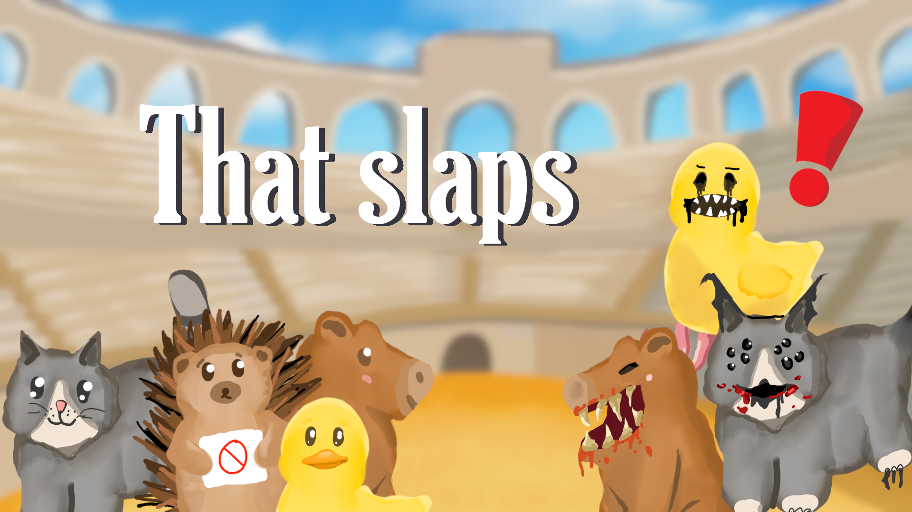
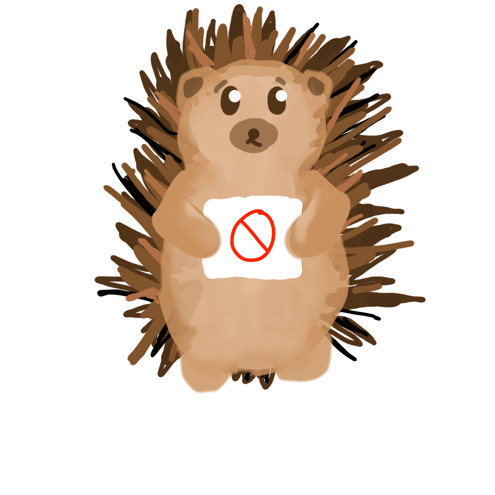

# That Slaps!

## Game Overview:
That slaps is a fast paced game where you need to let the cute creatures into the stadium and slap evil dopplegangers away, all with simple ai motion controls. Make a quick decision, and don't touch the hedgehog!

### How to play:
Move your hand horizontally to slap dopplegangers

and vertically to pet the creatures

Do not touch the hedgehog!

## Details:
The game is written in python3.14. It Uses media pipe to handle the hand tracking, and sdl2 for the rendering. All art was made by humans using sketchbook and the adobe suite.
The applause sound comes from https://pixabay.com/sound-effects/search/applause/

## How to run the game:
install all libraries and run the Game.py file (webcam required)
